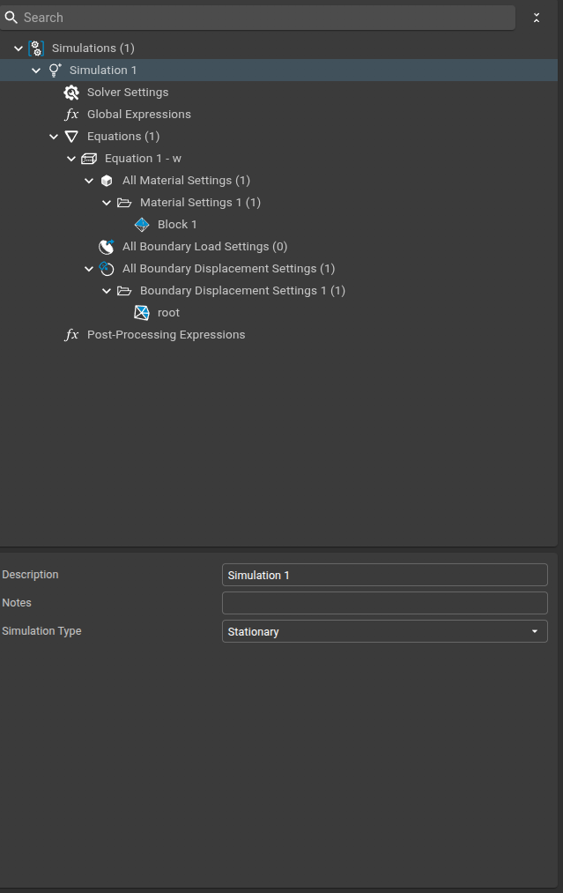
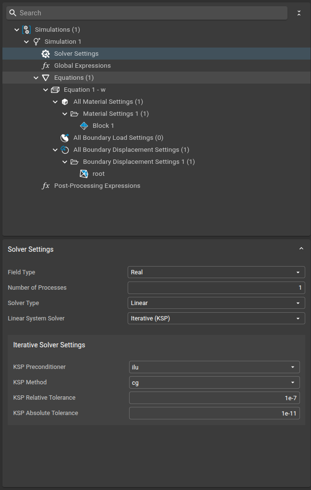
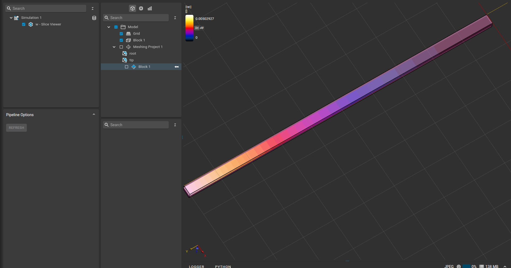

# Thermally Deformed Cantilever

This example demonstrates how to use the Sim4Life-FEniCS plugin to simulate the thermal deformation of a cantilever beam using solid mechanics.

## Physics

A cantilever beam made of aluminium (100 mm × 3 mm × 2.5 mm) is clamped at one end and free at the other. A temperature profile is applied along the height of the beam, causing it to deform due to thermal expansion. The simulation solves the linear elasticity equations with thermal expansion, computing the resulting displacement field.

---

## Step-by-Step

### 1. Model

The geometry consists of a rectangular cantilever beam, clamped at the root and free at the tip.

---

### 2. Simulation Settings

A new simulation is created and the solid mechanics equation is added.

---

### 3. Solver Settings

The solver is configured to use a linear, iterative method with tight tolerances for accurate results.

---

### 4. Equation Settings

The linear elasticity equation is selected, with the variable shape set to vector.

---

### 5. Material Settings

Material properties for aluminium are set:

- Young’s modulus: 69 GPa
- Poisson’s ratio: 0.3
- The thermal expansion coefficient and a temperature profile T(z) = z - h/2 are specified.

---

### 6. Boundary Settings

The root of the cantilever is fixed (zero displacement), while the other boundaries are left free.

---

### 7. Results

After running the simulation, the displacement field w is visualized using a slice field viewer.

---

