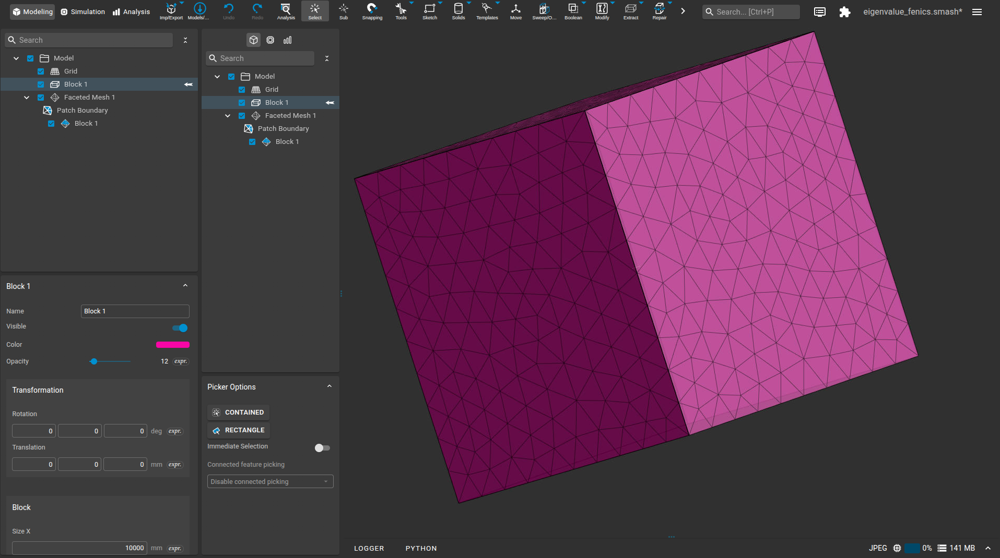
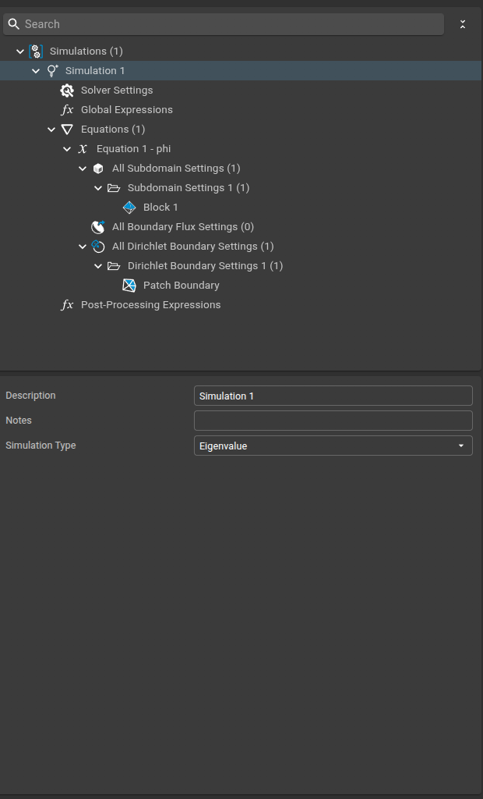
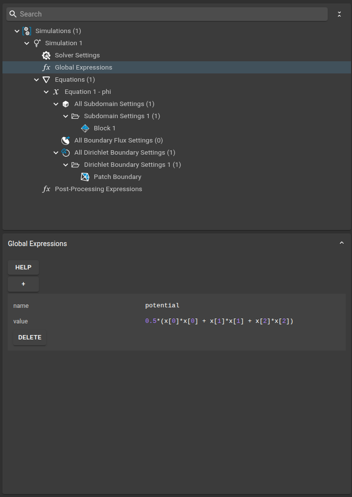
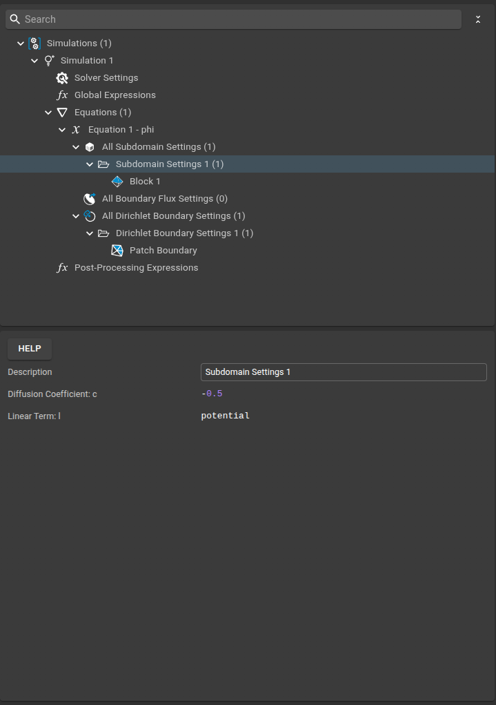

# Quantum Harmonic Oscillator: Eigenvalues

This example demonstrates how to compute the eigenvalues (energy states) of a quantum harmonic oscillator using the FEniCS plugin in Sim4Life. The setup and results can be loaded directly into Sim4Life using the `.smash` and `.sims` files in the `files` subfolder.

---

## Physics Background

The quantum harmonic oscillator is a fundamental model in quantum mechanics, describing a particle subject to a restoring force proportional to its displacement. The time-independent Schrödinger equation (TISE) for the 1D harmonic oscillator is:

$$
-\frac{1}{2} \nabla^2 \phi_i + \frac{1}{2} x^2 \phi_i = E_i \phi_i
$$

where $\phi_i$ is the $i$-th eigenfunction and $E_i$ the corresponding eigenvalue (energy level). Here, we use dimensionless units by scaling energy by $\hbar\omega$ and $x$ by $\sqrt{\hbar/(m\omega)}$.

The analytical solution for the energy levels is:

$$
E_n = \hbar\omega\left(n + \frac{1}{2}\right)
$$

---

## Mapping to the Weak Form

The FEniCS plugin solves the weak form of the eigenvalue problem:

$$
\int_\Omega \left(\frac{1}{2} \nabla \phi_i \cdot \nabla v + \frac{1}{2} x^2 \phi_i v\right) dx = E_i \int_\Omega \phi_i v \, dx
$$

where $v$ is a test function. This is set up in the plugin by specifying the diffusion and linear terms, and selecting the eigenvalue solver mode.

---

## Model Setup

The computational domain is a 1D or 2D region representing the oscillator potential. The mesh and subdomain assignments are shown below:

---

## Simulation Setup

### 1. Simulation Settings

- **Simulation Type:** Eigenvalue

---

### 2. Solver Settings

- **Solver Type:** Eigenvalue (e.g., SLEPc)
- **Number of Eigenvalues:** (as set in the UI)

---

### 3. Global Expressions

Global expressions can be used to define parameters, but for this example, the potential is hardcoded as $0.5 x^2$.

---

### 4. Equation

The equation settings specify the eigenvalue problem for the wave function $\phi_i$.

---

### 5. Subdomain Settings

The entire domain uses the same physics: kinetic and potential terms as described above.

---

### 6. Dirichlet Boundary Conditions

Dirichlet boundary conditions are applied to the domain boundaries:
- **Boundary Value:** $0$ (the wave function vanishes at the edges)

---

## How the Physics is Mapped

- **Diffusion coefficient:** $0.5$ (for the kinetic term $-\frac{1}{2} \nabla^2 \phi$)
- **Linear term:** $0.5 x^2$ (for the potential energy)
- The plugin constructs the weak form and solves for the lowest eigenvalues and eigenfunctions.

---

## Running the Simulation

1. Set up the geometry and physics as shown above.
2. Configure the solver and boundary conditions.
3. Run the simulation in eigenvalue mode.

---

## Results

The simulation computes the lowest energy eigenvalues and eigenfunctions of the quantum harmonic oscillator. The animation below shows the eigenfunctions visualized with the slice field viewer:

---

## References

- [FEniCS Project](https://fenicsproject.org/)
- [Quantum Harmonic Oscillator (Wikiversity)](https://en.wikiversity.org/wiki/User:Tclamb/FEniCS#Quantum_Harmonic_Oscillator)
