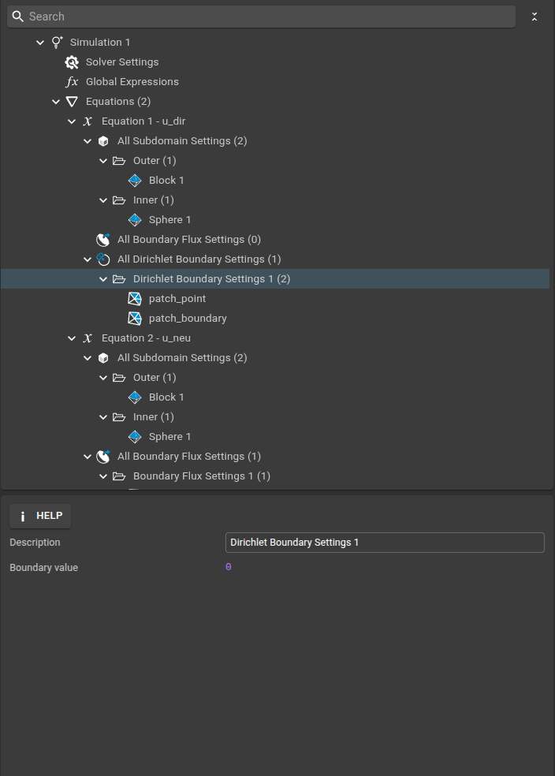
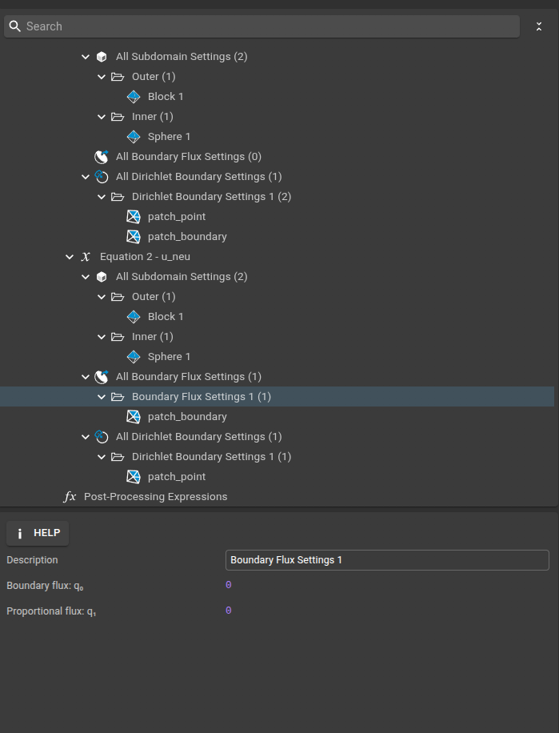
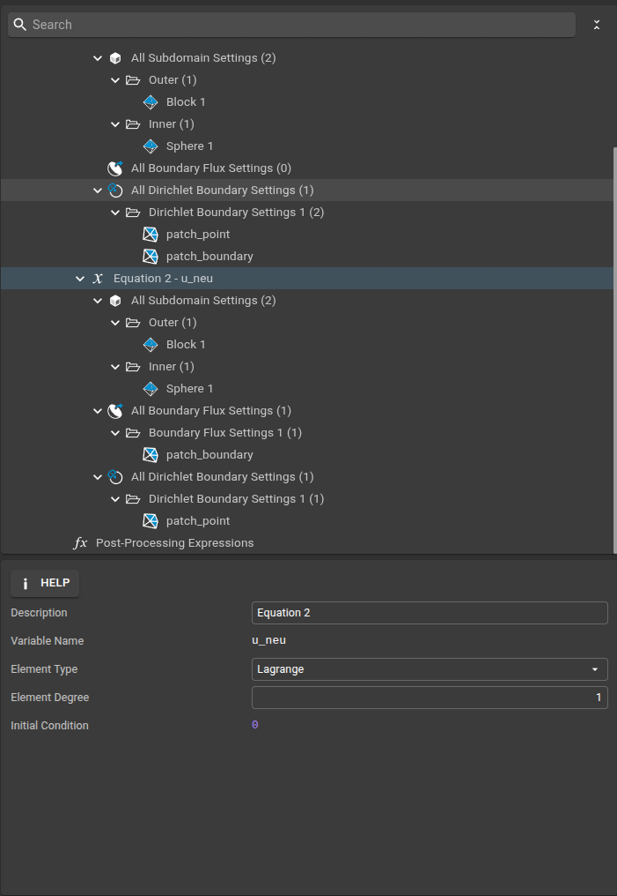
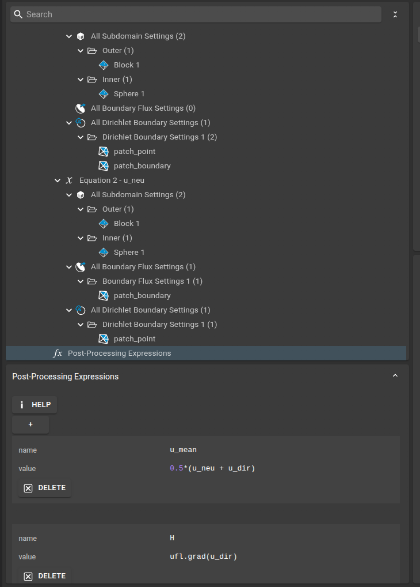
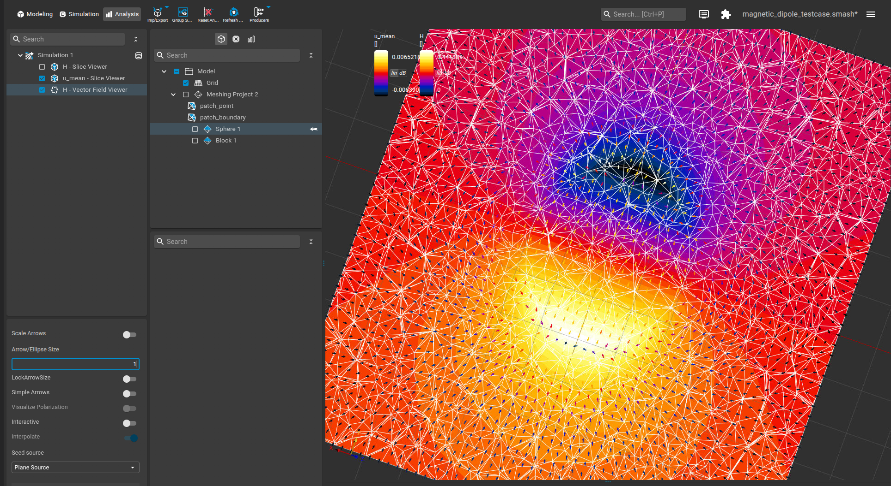

# Magnetized Sphere: Magnetic Dipole Field

This example demonstrates how to simulate the magnetic potential and field generated by a uniformly magnetized sphere using the FEniCS plugin in Sim4Life. The setup and results can be loaded directly into Sim4Life using the `.smash` and `.sims` files in the `files` subfolder.

---

## Physics Background

A uniformly magnetized sphere produces a uniform magnetic field inside and a dipole field outside. The magnetostatic potential $u$ satisfies:

$$
\nabla \cdot (-\nabla u + \mathbf{M}) = 0
$$

where $\mathbf{M}$ is the uniform magnetization. The solution is computed in a finite air cube, so the outer boundary is truncated. Two types of boundary conditions are used:

- **Dirichlet**: The potential is fixed on the boundary.
- **Neumann**: The normal derivative (flux) is fixed on the boundary.

Averaging the two solutions provides the best approximation to the analytical solution in the truncated domain.

---

## Model Setup

The computational domain consists of a sphere (magnetized region) embedded in a cubic air domain. The mesh and subdomain assignments are shown below:

---

## Simulation Setup

### 1. Solver Settings

- **Solver Type:** Linear (Direct LU)
- **Field Type:** Real

---

## Equation and Subdomain Settings

### Dirichlet Problem ($u_{dir}$)

- **Equation:**

  

- **Subdomain Settings:**
  - Outer region:
    
  - Inner sphere:
    

- **Boundary Conditions:**
  - Dirichlet at a single point (patch_point):
    
  - Dirichlet on the remaining boundary (patch_boundary):
    

- **Flux Boundary Condition:**
  

### Neumann Problem ($u_{neu}$)

- **Equation:**

  

- **Subdomain Settings:**
  - Outer region:
    
  - Inner sphere:
    

- **Boundary Conditions:**
  - Dirichlet at a single point (patch_point):
    

---

## Post-processing

After solving both problems, the following quantities are computed:

- **Average Potential:**
  $$
u_{mean} = 0.5 (u_{dir} + u_{neu})$$
- **Magnetic Field:**
  $$\mathbf{H} = \nabla u_{dir}$$

The average potential $u_{mean}$ is expected to be closest to the analytical solution everywhere, especially near the boundary. The magnetic field $\mathbf{H}$ should be uniform inside the sphere and dipole-like outside.

---

## Running the Simulation

1. Load the mesh and simulation setup files into Sim4Life.
2. Review and adjust the parameters as needed.
3. Run the simulation to compute the magnetic potential and field.
4. Visualize the results to compare with the analytical solution for a uniformly magnetized sphere.

---

## Results Visualization

The figure below shows the post-processed equations for mean field with a slice field viewer and the magnetic field using a vector field viewer.

---

## References
- [Magnetized Sphere - Analytical Solution](https://en.wikipedia.org/wiki/Magnetostatics#Uniformly_magnetized_sphere)
- [FEniCS Project Documentation](https://fenicsproject.org/)
