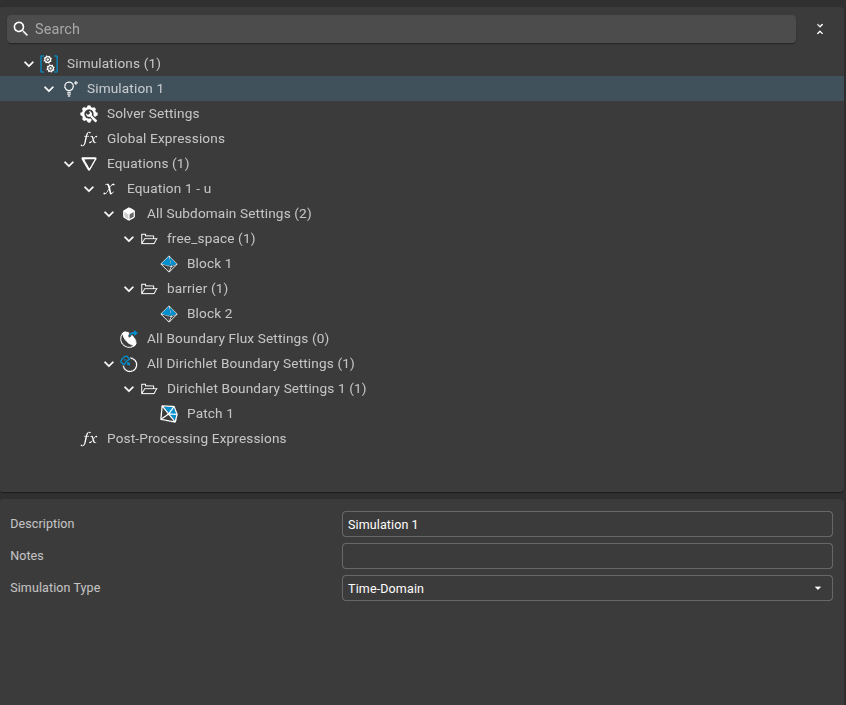
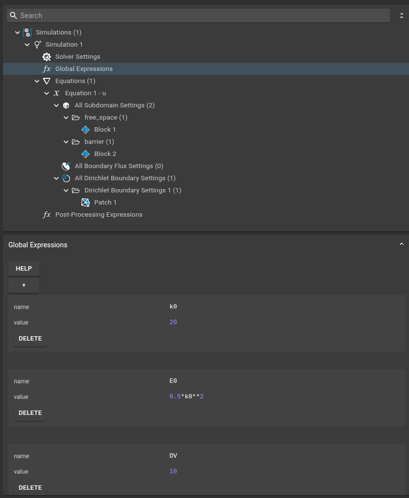
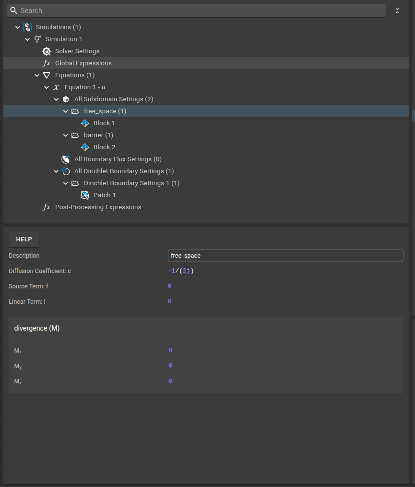

# Quantum Tunneling

This example can be loaded directly into Sim4Life by uploading the provided `.smash` and `.sims` files from the `files` subfolder. To do this, use the burger menu in the Sim4Life user interface and select the `.smash` file to load the complete example setup.

This example demonstrates how to simulate **quantum tunneling** using the FEniCS plugin in Sim4Life. The setup models a Gaussian wave packet incident on a potential barrier, illustrating the fundamental quantum phenomenon of tunneling.

---

## Physics Background

Quantum tunneling is a phenomenon where a quantum particle can pass through a potential barrier even if its energy is less than the barrier height. This is governed by the time-dependent Schrödinger equation:

$$
i \frac{\partial u}{\partial t} = -\frac{1}{2} \nabla^2 u + V(x) u
$$

where $u(x, t)$ is the wave function and $V(x)$ is the potential (nonzero in the barrier region).

---

## Model Setup

The computational domain is modeled as a rectangle, subdivided into two main regions: a central **barrier** and surrounding **free space**. This allows us to represent a potential barrier in the middle of the domain, with free propagation regions on either side. The mesh and subdomain assignments are shown below:


---

## Simulation Setup

### 1. Simulation Settings

We use the **Time-Domain** as the simulation type for this example.



---

### 2. Solver Settings

- **Field Type**: Complex
- **Solver Type**: Linear (Direct LU)
- **Time Domain Solver**:
  - Method: LobattoIIIA (Runge-Kutta)
  - Stages: 3
  - Initial Time Step: 0.001
  - Max Time Step: 1
  - Duration: 0.15


---

### 3. Global Expressions

Global expressions define the physical parameters used in the simulation:
- `k0 = 20` (wavenumber of the initial wave packet)
- `E0 = 0.5*k0**2` (energy of the wave packet)
- `DV = 10` (potential barrier height)



---

### 4. Equation

The time-dependent Schrödinger equation is solved for the wave function \(u\).

- **Initial Condition:**
  ```python
  ufl.exp(1j*x[1]*k0)*ufl.exp(-ufl.inner(x,x)/(2*0.5**2))
  ```
  This represents a Gaussian wave packet with wavenumber `k0`.


---

### 5. Free Space

- **Diffusion Coefficient:** `-1/(2j)` (kinetic term)
- **Linear Term:** `0` (no potential in free space)



---

### 6. Barrier

- **Diffusion Coefficient:** `-1/(2j)` (kinetic term)
- **Linear Term:** `(E0 + DV)/(1j)` (potential energy in the barrier)


---

### 7. Dirichlet Boundary Conditions

A Dirichlet boundary condition is applied:
- **Boundary Value:** `0` (the wave function is set to zero on the specified boundary)


---

## How the Physics is Mapped

- The **diffusion coefficient** \(-1/(2j)\) implements the kinetic term \(-\frac{1}{2} \nabla^2 u\).
- The **linear term** in the barrier region adds the potential energy.
- The **weak form** is constructed automatically by the plugin, following the variational principle.

---

## Running the Simulation

1. Set up the geometry and physics as shown above.
2. Configure the solver and boundary conditions.
3. Run the simulation in time-domain mode.

The solver output will show progress through time steps and confirm successful completion.

---

## Results

The simulation produces the time evolution of the wave function, showing both reflection and tunneling through the barrier.


The results can be interactively inspected and visualized using the built-in viewers in Sim4Life, allowing you to explore the wave function dynamics over time.

---

## References

- [FEniCS Project](https://fenicsproject.org/)