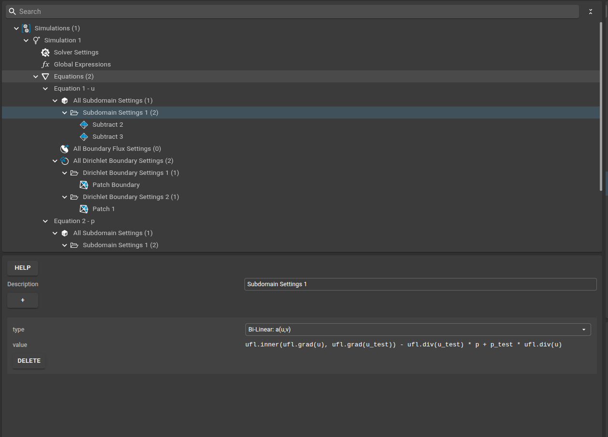
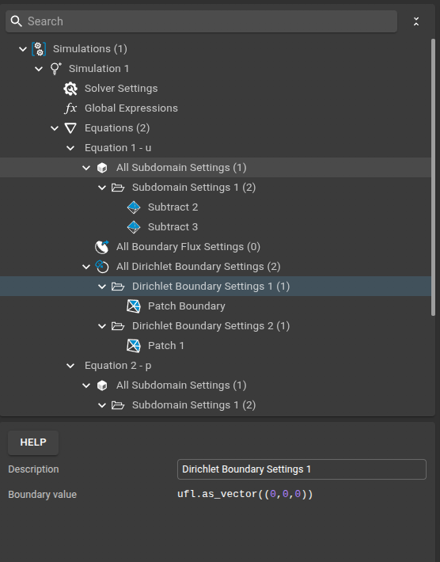
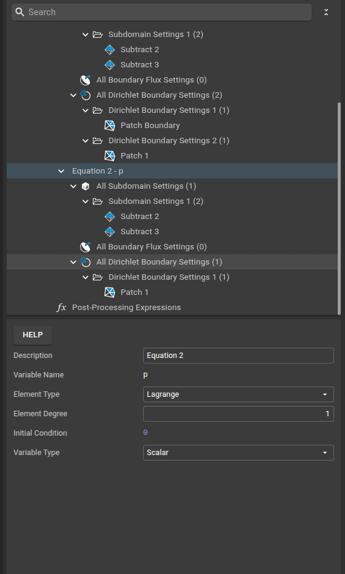
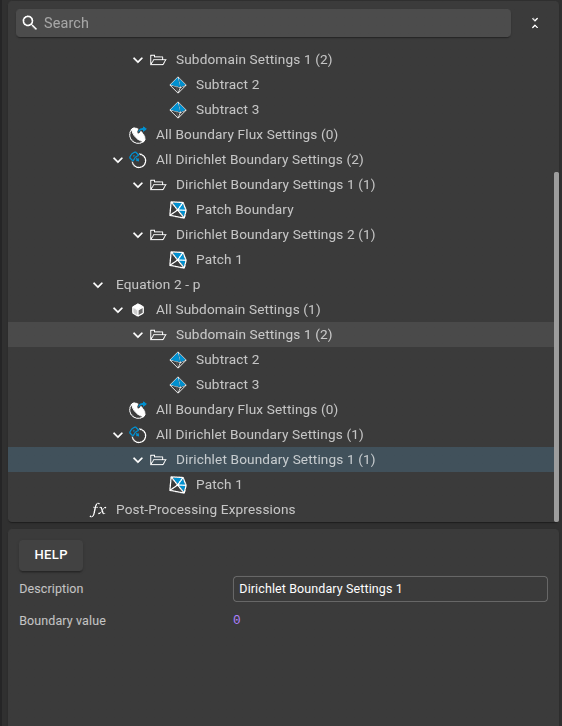

# Stokes Flow Past a Sphere

This example demonstrates how to simulate steady Stokes flow past a sphere using the FEniCS plugin in Sim4Life. The setup and results can be loaded directly into Sim4Life using the provided mesh and simulation setup files.

---

## Physics Background

Stokes flow describes the motion of a viscous, incompressible fluid at low Reynolds numbers, where inertial forces are negligible compared to viscous forces. The governing equations are:

$$
-\mu \nabla^2 \mathbf{u} + \nabla p = 0 \\
\nabla \cdot \mathbf{u} = 0
$$

where $\mathbf{u}$ is the velocity field, $p$ is the pressure, and $\mu$ is the dynamic viscosity.

---

## Mapping to the Weak Form

The FEniCS plugin solves the weak form of the Stokes equations. For test functions $\mathbf{v}$ (velocity) and $q$ (pressure):

$$
\int_\Omega \nabla \mathbf{u} : \nabla \mathbf{v} \, dx - \int_\Omega p \, \nabla \cdot \mathbf{v} \, dx + \int_\Omega q \, \nabla \cdot \mathbf{u} \, dx = 0
$$

This is implemented in the plugin by adding the following bilinear form in the subdomain settings for $\mathbf{u}$:

```python
ufl.inner(ufl.grad(u), ufl.grad(u_test)) - ufl.div(u_test) * p + p_test * ufl.div(u)
```

where:
- `u` is the velocity trial function ($\mathbf{u}$)
- `u_test` is the velocity test function ($\mathbf{v}$)
- `p` is the pressure trial function ($p$)
- `p_test` is the pressure test function ($q$)

This directly corresponds to the weak form above, with each term mapping as follows:
- `ufl.inner(ufl.grad(u), ufl.grad(u_test))` $\rightarrow$ $\int_\Omega \nabla \mathbf{u} : \nabla \mathbf{v} \, dx$
- `- ufl.div(u_test) * p` $\rightarrow$ $-\int_\Omega p \, \nabla \cdot \mathbf{v} \, dx$
- `p_test * ufl.div(u)` $\rightarrow$ $\int_\Omega q \, \nabla \cdot \mathbf{u} \, dx$

---

## Model Setup

The computational domain consists of a sphere embedded in a rectangular box, representing the fluid region around the sphere. The mesh and subdomain assignments are shown below:


---

## Simulation Setup

### 1. Simulation Settings

- **Simulation Type:** Stationary (steady-state)


---

### 2. Solver Settings

- **Solver Type:** Linear (Direct LU)
- **Field Type:** Real


---

## Equation and Subdomain Settings

### Velocity Field $\mathbf{u}$

- **Equation:**

  

- **Subdomain Settings:**

  

- **Dirichlet Boundary Conditions:**
  - Inlet (left boundary): $\mathbf{u} = (1, 0, 0)$
    
  - Sphere surface: $\mathbf{u} = (0, 0, 0)$ (no-slip)
    

### Pressure Field $p$

- **Equation:**

  

- **Subdomain Settings:**

  

- **Dirichlet Boundary Condition:**
  - Outlet (right boundary): $p = 0$
    

---

## Running the Simulation

1. Load the mesh and simulation setup files into Sim4Life.
2. Review and adjust the parameters as needed.
3. Run the simulation to compute the velocity and pressure fields.
4. Visualize the results to observe the flow pattern and pressure distribution around the sphere.

---

## Results Visualization

The figure below shows the velocity distribution around the sphere, visualized in Sim4Life using a combination of a slice field and vector field viewer. This allows you to see both the magnitude and direction of the flow as it moves past the sphere:


---

## References
- [Stokes Flow - Wikipedia](https://en.wikipedia.org/wiki/Stokes_flow)
- [FEniCS Project Documentation](https://fenicsproject.org/)
